# This is a markdown file guiding you through the very first steps to create and manage a git repo with github.

## Lets start on your bash shell
Crete a directory


```
mkdir gittest_fbianco
```

Get in the directory to start working

```
cd gittest_fbianco/
```

The following command initiates a LOCAL git repository: files can be tracked on your own machine from now on.

```
git init
git status
```

Create a first file. This command creates an empty file with the name you pass as argument (myfirstfile.txt)

```
touch myfirstfile.txt
```

See if it got created ok

```
ls -l
git status
```

Your git repo knows nothing about it yet: you need to add it to the repo for it to be tracked.

```
git add myfirstfile.txt 
git status
```

Can we commit it to github to have it in the cloud?

```
git commit myfirstfile.txt -m 'trying to commit'
git push
```

### Why did you get an error message?? because you have not told this repo where in the cloud to look for its remote version

## Go online and create a repository. 
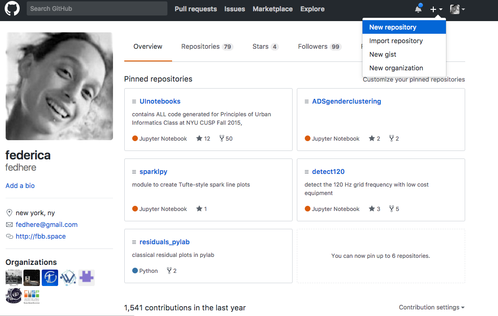

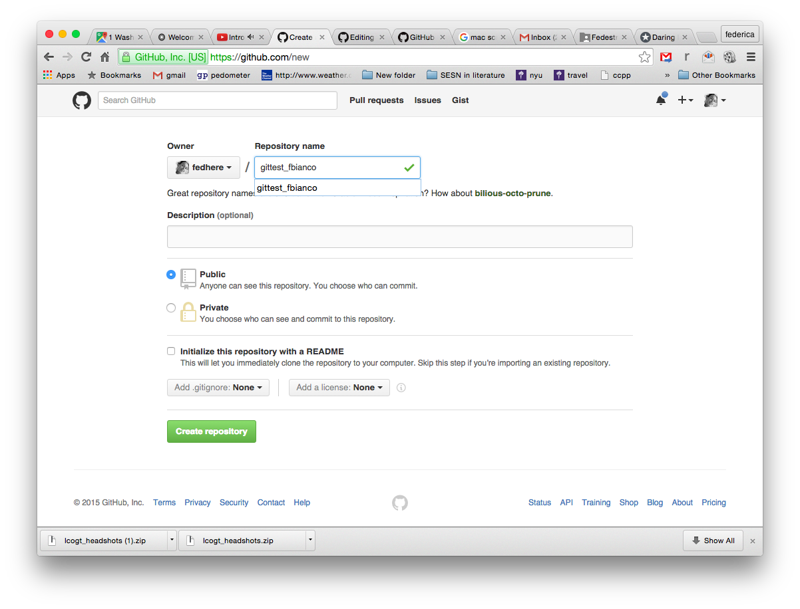

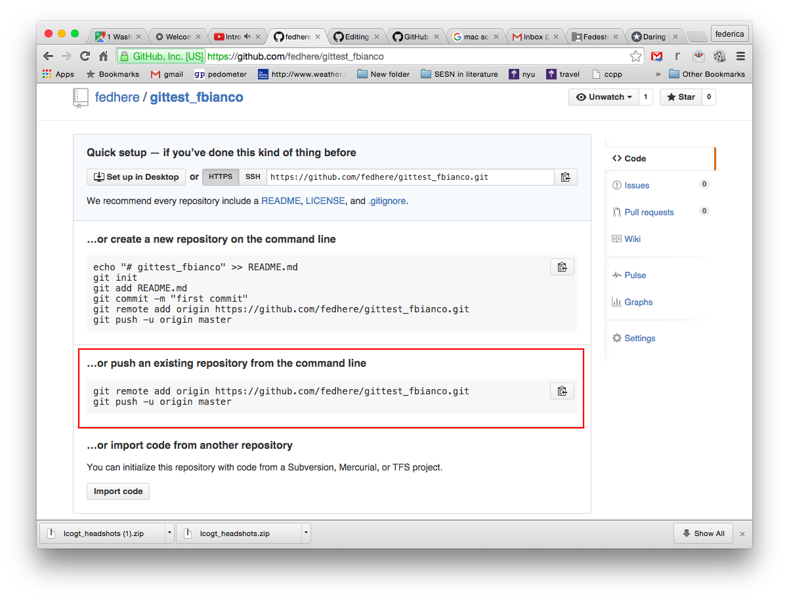

then follow the directions in the image above (use the appropriate URL in the command below)

```
git remote add origin  https://github.com/fedhere/gittest_fbianco.git
git push -u origin master 
```

The following commands show you what URL you push and pull from (need not be the same generally)

```
git remote -v 
git status
```

## Lets make local changes to the file...

```
echo "whatever" >> myfirstfile.txt 
git status
```

...and commit them...

```
git commit myfirstfile.txt -m 'commit changes'
```

...and send them to the cloud.

```
git push 
```

Now go online to your new github repo, and make changes directly to the online version of the file online

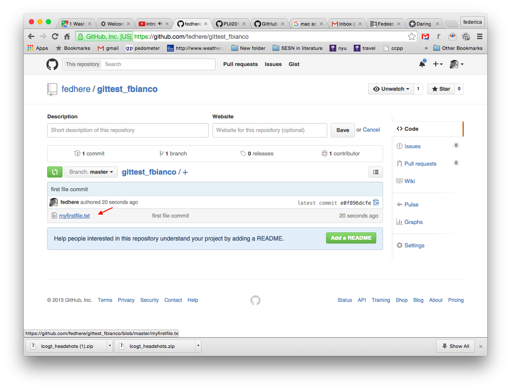


and make some local changes as well on your machine.

```
echo  "this is gonna go wrong..." >> myfirstfile.txt 
git commit myfirstfile.txt -m 'commit changes without pulling first'
git push
```

### Congratulations: you got your first merge conflict! 

## To fix a merge conflict  
pull the changes over first.

```
git pull
```

Edit the file removing the lines starting with \>\>, \<\<, and ==, and decide what you want the file to look like to solve the conflict. I will use the editor _emacs_, but you can use whatever you like to edit the file (e.g. jupyter, or the mac text editor or whatever) 

```
emacs myfirstfile.txt 
```
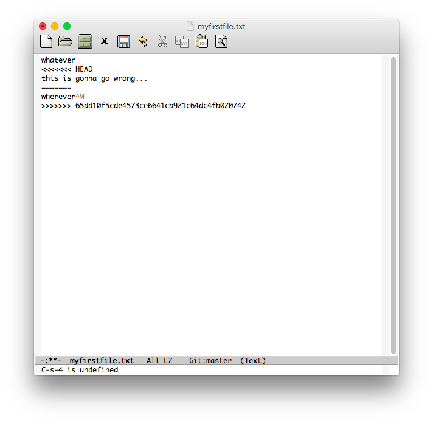

make the necessary changes. _whatever changes you decide upon you must remove the lines starting with >>>>, <<<<, and =====!_

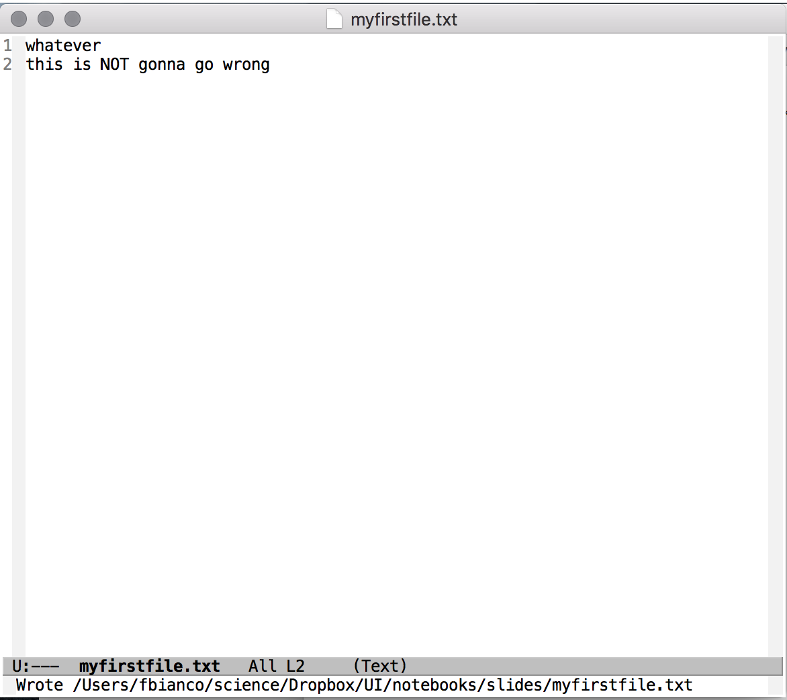

Now add the file again and commit. 
(NOTE: the commit has to be global. i.e. you cannot use git commit myfirstfile.txt and commit only that right now: you have to commit everything.)

```
git add myfirstfile.txt 
git commit   -m 'solving merge conflict'
git push
```

(NOTE: you could also have stashed (thrown away) your changes when you got the error message

```
git stash
```
which, again, would throw away all the changes you had just made and committed, so be careful)

## Now let's mess with someone else's repo! the lady or gentelman to your left will do.
Go online and fork your neighbor's repo, 
then clone it: the URL was given to you online on your fork page 

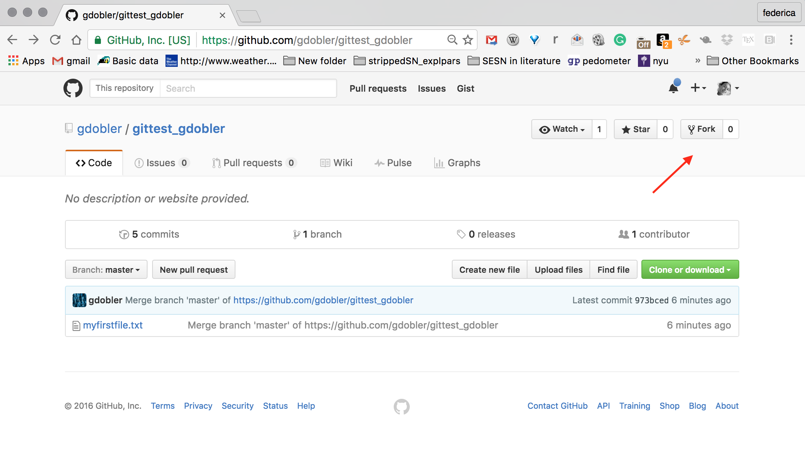
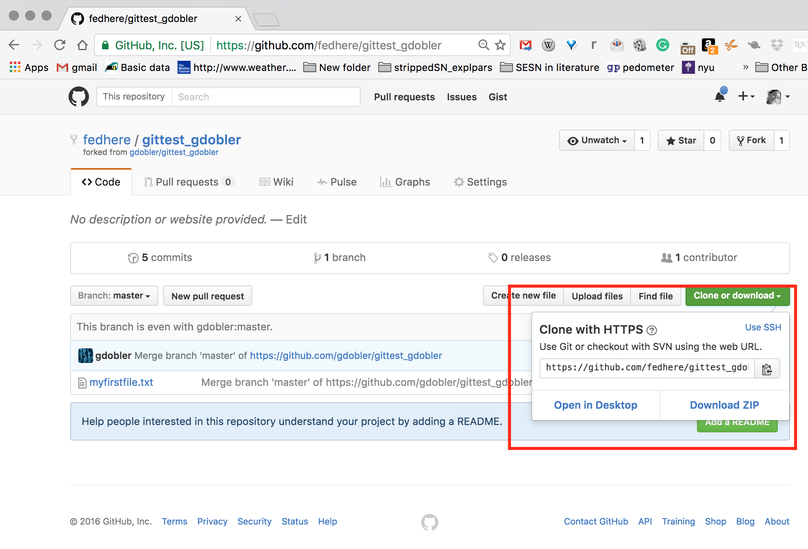

```
cd ../
git clone https://github.com/fedhere/gittest_<the neighor on your left>.git
ls -ltr
cd gittest_<the neighor on your left>
ls
```

mess with it by adding a new line (NOTE: if you change an existing line, and your friend also changes it that will crete a conflict which is difficult to resolve. Just add a line for the moment)

```
echo "Hello there, this is Dr Bianco messing with your file" >> myfirstfile.txt 
git commit myfirstfile.txt  -m "messing with my neighbor's repo"
git push
```

Go online to your fork, check the changes, request a merge! You are asking your friend to embrace your changes.

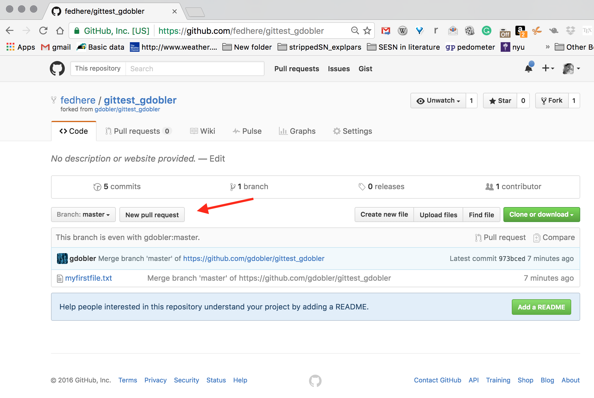
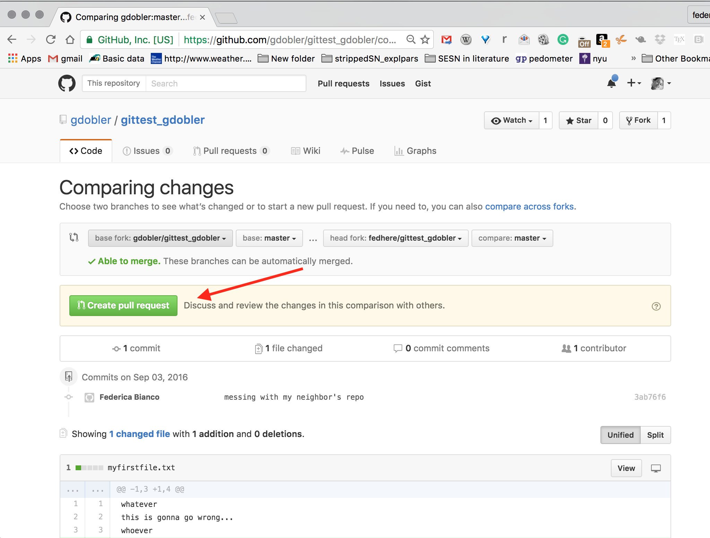

## Back to your own repo: accept your friend's pull request
check your email: you will find the merge request from your new friend!
Let's get back to our own repo online and look for pull requests. Let's accept this request!

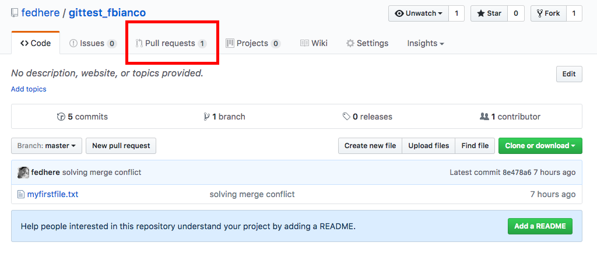


```
cd -
cd gittest_fbianco/
git status
git pull
less myfirstfile.txt 
git log
```

### Now don't forget to pull the file before you make more changes or you may get another conflict! 
### This is the end of the exercise. The following instructions are additional, to help you if you run into trouble with merges, and to maintain your fork up to date.

______________________________________________________________

## Dealing with a conflicting merge

If you change _a different line_ than the one your friend changed, the merge should work.
If you change _the same line_ changed by someone working on the master repository then the merge will cause a conflict. Github will warn you when you submit the pull request, and the admin of the master needs to solve the conflict. 

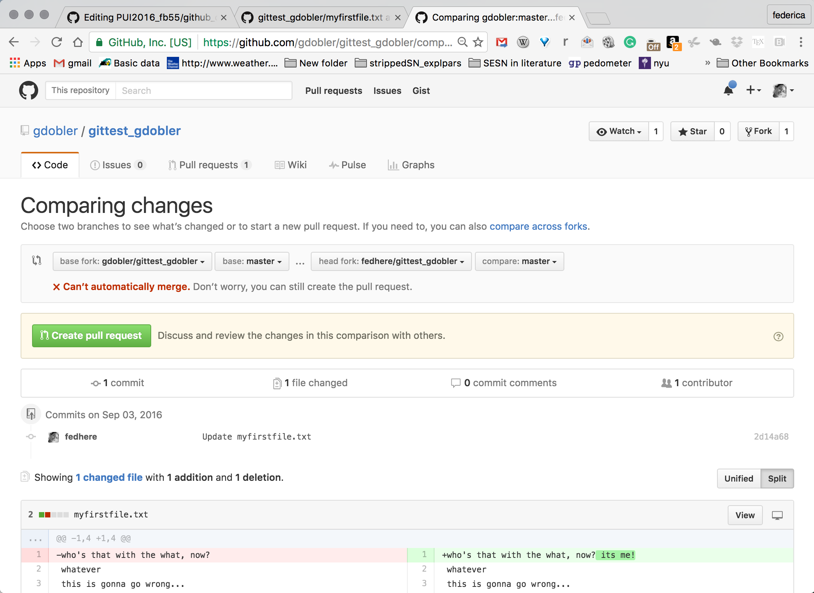

Follow the instructions to fix the merge online, but note: where github says to resolve the merge and upload the changes to Github there are a few implicit steps. I am spelling them below. Github will have instructions similar to:

  ```
  git checkout -b gdobler-master master
  git pull https://github.com/gdobler/gittest_fbianco.git master
  ```
Edit the files as needed. Then the next two lines are implicitly assumed in the Github directions: add the file again and push it _to the new branch_ .

  ```
  git add myfirstfile.txt 
  git push origin gdobler-master
  ```
Online you will see __your own__ pull request: 

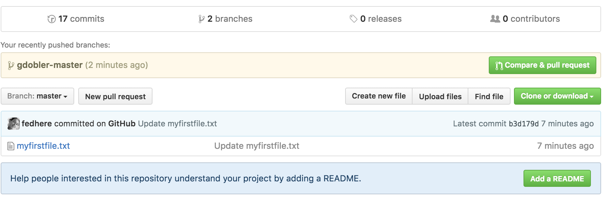

This is the request to merge your two branches. Follow the instructions online.
Things can get very complicated here with merges and conflicts.... if you are confused you are not alone!


## Maintain the fork up to date and synced with the master

Follow the instructions here:
https://help.github.com/articles/syncing-a-fork/
